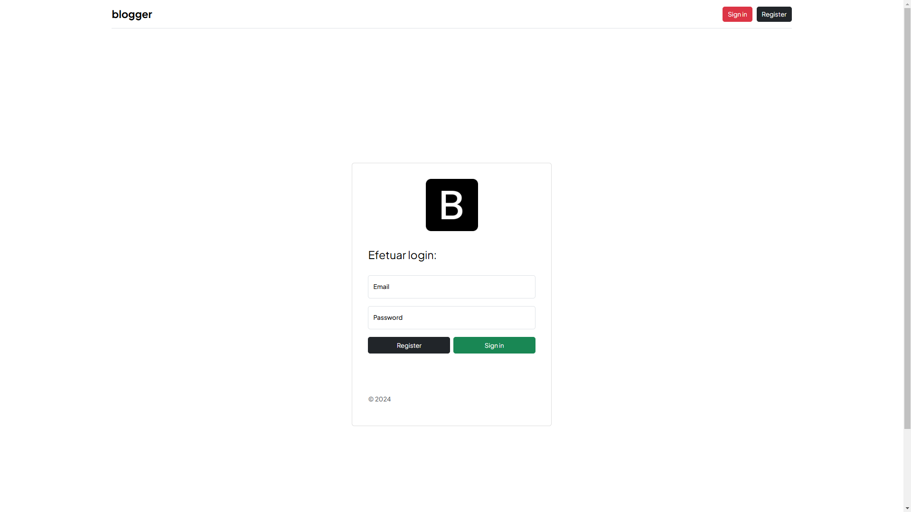
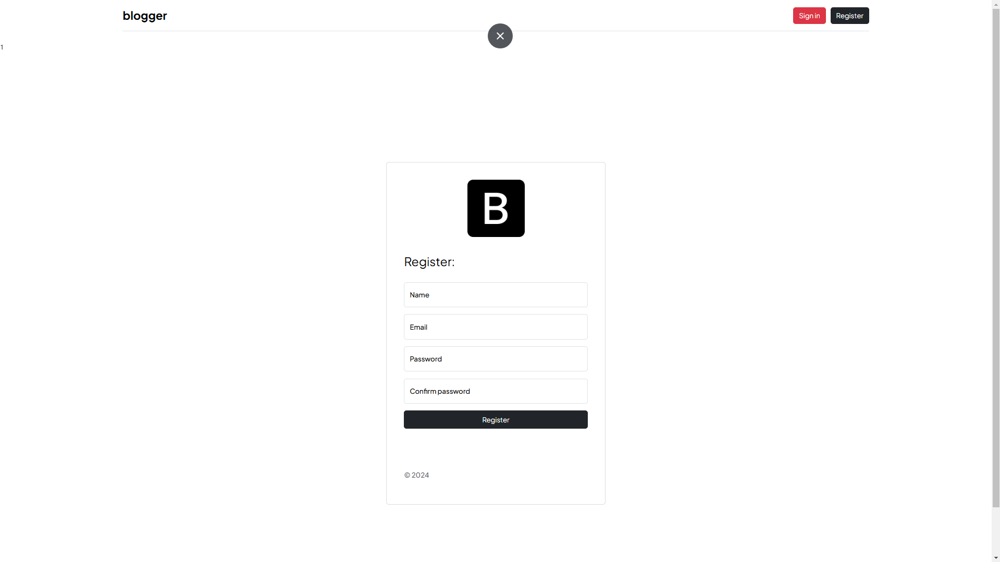
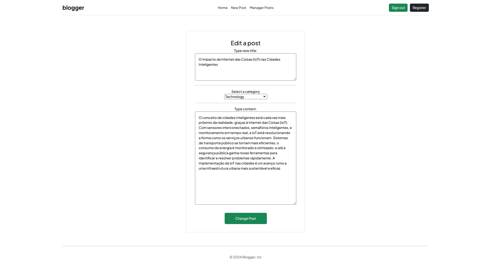
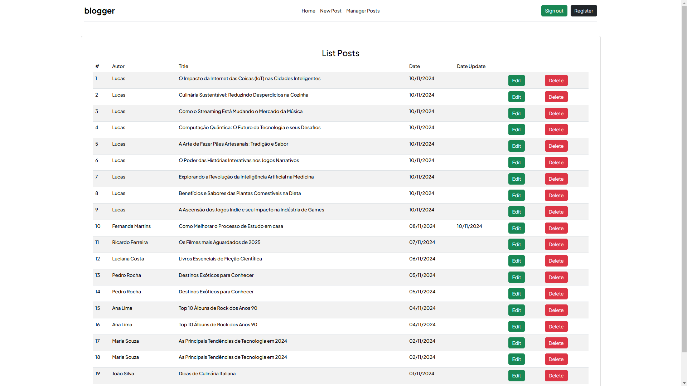

# Blog em PHP

Este é um projeto de blog desenvolvido em PHP que implementa funcionalidades completas de CRUD (Create, Read, Update, Delete).

## Índice

- [Visão Geral](#visão-geral)
- [Funcionalidades](#funcionalidades)
- [Instalação](#instalação)
- [Tecnologias Utilizadas](#tecnologias-utilizadas)
- [Imagens do projeto](#imagens-do-projeto)

## Visão Geral

Este blog em PHP foi desenvolvido com o objetivo de facilitar a criação e gestão de postagens. Ele permite que os administradores realizem operações básicas de CRUD, gerenciando conteúdo de maneira intuitiva. A estrutura do projeto foca na escalabilidade e no fácil entendimento do código.

## Funcionalidades

- **Criar Postagens**: Criação de novas postagens com título, categoria, autor, conteúdo e data de publicação.
- **Visualizar Postagens**: Exibição de todas as postagens no blog, com opção de visualizar o conteúdo completo de cada uma.
- **Editar Postagens**: Edição de postagens já publicadas, permitindo a atualização do título, conteúdo e categoria.
- **Excluir Postagens**: Remoção de postagens que não são mais necessárias.
- **Filtragem por Categoria**: Navegação facilitada por categorias para uma melhor organização do conteúdo.

## Instalação

1. **Clone o Repositório**
   ```bash
   git clone https://github.com/LucasDias2002/Blog.git
   cd Blog

2. **Banco de dados**
   ```
   Importe o arquivo blogger.sql disponível no repositório para criar as tabelas necessárias.

## Tecnologias Utilizadas

1. **PHP**: Linguagem principal para a lógica do servidor e manipulação do banco de dados.
2. **MySQL**: Banco de dados relacional para armazenar as informações das postagens.**
3. **HTML/CSS**: Estrutura e estilo das páginas.

## Imagens do projeto
1. *Página Login*

2. *Página Cadastro*

3. *Página Inicial*

4. *Página Post Detalhada*

5. *Página de Criar e Editar Post são similares*

6. *Página de Gerenciar Posts*

<h1 align="center">Obrigado</h1>
